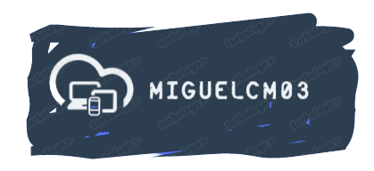

  <!-- You are encouraged to replace this logo with your own! Otherwise you can also remove it. -->
  
   

  <h3><b>Microverse's Little Survey</b></h3>

<!-- TABLE OF CONTENTS -->

# 📗 Table of Contents
 
- [📖 About the Project](#about-project)
  - [🛠 Built With](#built-with)
  - [🚀 Live Demo](#live-demo)
- [💻 Getting Started](#getting-started)
- [👥 Authors](#authors)
- [🔭 Future Features](#future-features)
- [🤝 Contributing](#contributing)
- [⭐️ Show your support](#support)
- [🙏 Acknowledgements](#acknowledgements)
- [📝 License](#license)

<!-- PROJECT DESCRIPTION -->

# 📖 Microverse's Little Survey 

**Microverse's Little Survey** this is the third project that I do for Microverse, in this occasion, you're going to see a little form survey that I did with a Microverse Trial Partner before to start the program.

## 🛠 Built With 

The project was built with:
* HTML
* CSS

### Tech Stack 

The project uses the following technologies: Git, Github, linters (stylelint, Lighthouse and Webhint).

(<a href="#readme-top">back to top</a>)

<!-- LIVE DEMO -->

## 🚀 Live Demo 

- [Live Demo Link]()

This is a screenshot of the project.

(<a href="#readme-top">back to top</a>)

<!-- GETTING STARTED -->

## 💻 Getting Started 

To get a local copy up and running, follow these steps:

*1* You should open your Terminal and copy the SSH link to clone it to your local machine.
 
*2* When you had downloaded it, you can run it open the index.html file on your browser.

### Setup

Clone this repository to your desired folder:

using this: 
  git clone git@github.com:migcm06/microverse-trial-copy.git

<!-- AUTHORS -->

## 👥 Authors 

👤 **Miguel Cuello**

- GitHub: [@githubhandle](https://github.com/migcm06)
- LinkedIn: [LinkedIn](https://www.linkedin.com/in/luis-miguel-cuello-a5a6b5144/)

👤 **Abenezer Samuel**

- GitHub: [@githubhandle](https://github.com/abenisamuel11)

(<a href="#readme-top">back to top</a>)

<!-- FUTURE FEATURES -->

## 🔭 Future Features 

- [1] I would like to work in the layout to improve the design.

<!-- CONTRIBUTING -->

## 🤝 Contributing 

Contributions, issues, and feature requests are welcome!

Feel free to check the [issues page](../../issues/).

(<a href="#readme-top">back to top</a>)

<!-- SUPPORT -->
## ⭐️ Show your support 

If you like this project, please let me know it in a comment or if you want reply it and it don't run for you i will be happy to help you.

(<a href="#readme-top">back to top</a>)

## 🙏 Acknowledgments 

I would like to mention that this project was build a few weeks ago with my partner from Ethiopia, Abenezer Samuel. It was nice and fun to work on this project with him.

<!-- LICENSE -->

## 📝 License 

This project is [MIT](./MIT.md) licensed.

(<a href="#readme-top">back to top</a>)

